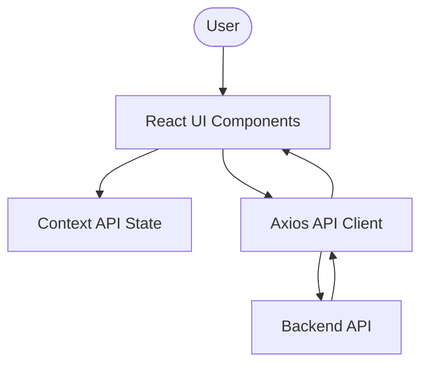

# UMA Client Architecture

This document provides an overview of the technical architecture of the UMA Frontend application. It is designed to help **Architects** and **Developers** understand the "Big Picture" of how the UI handles data and user interactions.

## High-Level Flow

## Core Components

### 1. State Management (Context API)
We use the native React Context API for global state management. This keeps the application lightweight without the overhead of Redux.
- **`AuthContext`**: Manages user sessions, JWT rotation, and authentication state.
- **`ThemeContext`**: Manages the Dark/Light mode selection and persistence in `localStorage`.

### 2. Layout System
The application uses a **Layout-based routing** strategy:
- `Layout.jsx`: The shell of the app, containing the `Sidebar` and `Header`.
- `Sidebar.jsx`: Dynamic navigation that changes based on the user's role (Admin vs Employee).

### 3. API Interceptor Layer
All communication with the backend passes through `src/api/axios.js`. 
- **Auto-Auth**: Automatically adds the `Bearer` token to every request.
- **Token Rotation**: If a request fails with a 401 error, the interceptor attempts to refresh the token using the Refresh Token and retries the original request seamlessly.

## Design Decisions

- **Vite 6**: Used for near-instant development starts and optimized production builds.
- **Tailwind CSS 4.0**: Used for rapid, utility-first styling with zero runtime CSS.
- **Leaflet & Google Maps**: Dual integration for geological features. Leaflet handles the base maps, while Google Maps API handles the precise geofencing calculations.

## Future Improvements (Architecture Roadmap)

1. **Atomic Design**: Move from current page-based component structure to a more granular Atomic Design (Atoms, Molecules, Organisms).
2. **State Machines**: Implement `XState` for complex attendance marking flows to prevent race conditions.
3. **PWA Support**: Implement Service Workers for offline attendance logging.

---
**Role-Specific Tips:**
- **Architects**: Check `src/routes/ProtectedRoute.js` to see how role-based access is enforced.
- **Developers**: See `src/hooks/` for shared logic.
